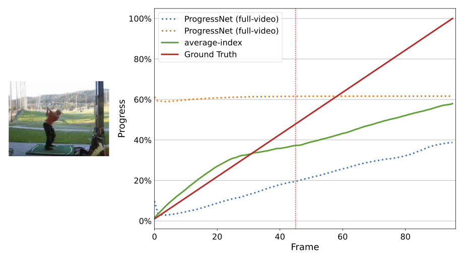
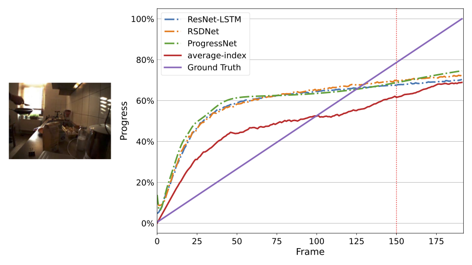
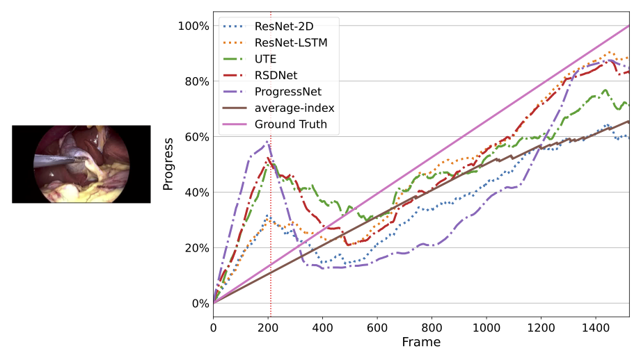

# Is there progress in activity progress prediction?

Official PyTorch implementation of "Is there progress in activity progress prediction".

[[TODO](google.com)] [[TODO](google.com)]

Please cite the paper when reporting, reproducing or extending the results.

```bibtex
TODO
```

## Overview

- Image

## Results

ProgressNet predictions on a video from the Golfswing activity for both full-video sequences (blue) and video-segments (orange) at timestamp t=125. The methods cannot learn when given video-segments.


etwork predictions on a video from the ‘pancake’ cooking activity for all LSTM-based methods when given full-video sequences of random-noise at timestamp t=150. The networks cannot learn from the data and instead learn how to count.


Progress prediction example on Video-04 of Cholec80 at timestamp t=210. The methods recognize the surgical tool and correct their progress to signal the start of the procedure.


## Datasets

We performed our testing on [UCF101](https://www.crcv.ucf.edu/data/UCF101.php), more specifically [these annotations for UCF101-24](https://github.com/gurkirt/corrected-UCF101-Annots), [Breakfast](https://serre-lab.clps.brown.edu/resource/breakfast-actions-dataset/), and [Cholec80](http://camma.u-strasbg.fr/datasets). Furthermore, we test on a toy dataset called `Progress-bar` which can be generated with the code.

## Using the code